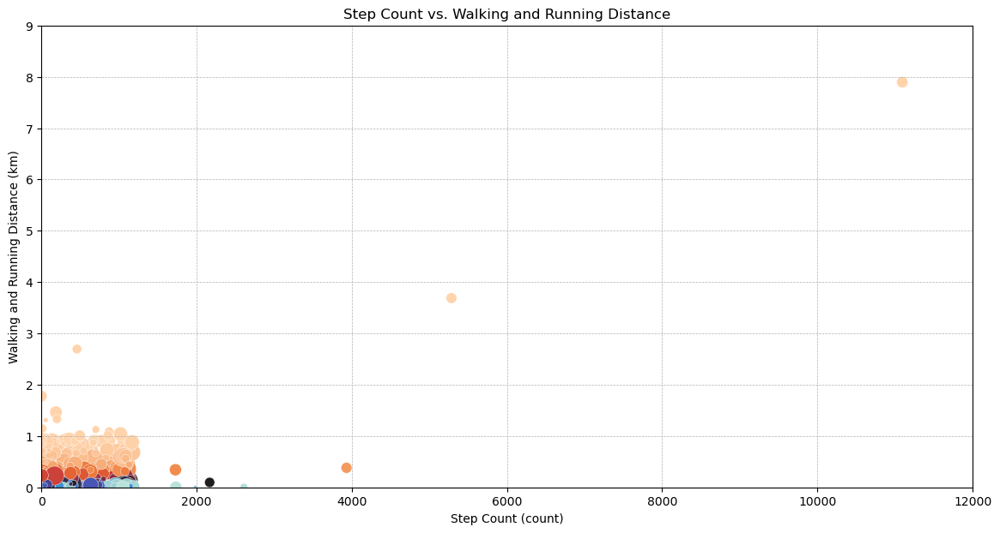
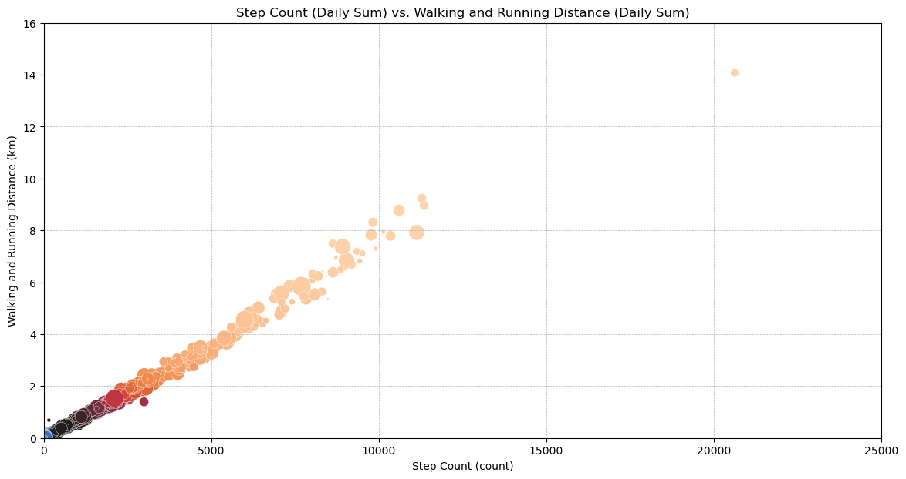

# Welcome to my repository!
This is the course project of CS 210, the course Introduction to Data Science, in Sabancı University.

## Main motivation of this project
I was curious about my physical activity and how to analyze that for some time. With this project, I basically found that opportunity, and tried to analyze my health records as much as I could have done.

## What you are going to see in this project?
You are going to see the following as the materials of the project: 
* The Jupyter notebook I used for the entire process

* The final report in the form of a PDF file

* A folder named "Graphs" where you can find most of the possible graphs to generate using the data I have

## What I have learned about myself in this project?
I have learned that getting involved in more intensive tasks improves my situation with physical activity compared to other time periods, but the thing is that the comparison of the periods of intensive tasks require more data than I have managed to gather so far. So if I will plan updating this repository one day, it is definitely going to be one of my main focal points.

## FAQ

### Q: From where the data were found?
A: I have exported the data from my smartphone, using Apple Health, as a collection of all of the health-related records in my previous and current smartphones.

### Q: Which timeframe do the data cover?
A: The data covers a timeframe from November 2017 to November 2023, which includes some of the key milestones of my life which you can see in the notebook, and in the report.

### Q: Are the data shared or going to be shared?
A: Since these data are my personal data at the end, it is my decision whether to share them or not, and I opt for not sharing my personal data in any case.

### Q: Are all of the graphs included in the report?
A: The graphs describing distributions, changes over time, and the relations specified within the text are available in the report as appendices. The other ones are available in the Graphs folder.

### Q: Aside from the correlation matrices, there are two kinds of charts in the Graphs folder. Why?
A: At first, I have tried to analyze the data on the basis of individual recordings, and I have drawn my charts and plots accordingly. However, as I have progressed in the project, as you can see in the notebook, I have decided that it was not feasible to continue with that approach, and instead, I have switched to grouping the records based on their creation dates, as I have explained in the report. The ones with **"daily"** at the beginning of the filename are the graphs created using the latter approach, while the ones (not the correlation matrices) that do not carry this moniker are generated using the first (kind of failed) approach, but I nevertheless wanted to keep them as an indicator of my progress. Below, you are going to see a comparison between the two approaches. Pay attention to the linear correlation in the second graph, and compare it to the correlation matrices. You can also try to see this with the other graphs in the Graphs folder.

### Q: Correlation matrices? I see that there are four of them. Which one should I look at?
A: All of them. Literally all of them. See the report for why I had to create four different correlation matrices.

### Q: Why there seems to exist a lot of zeros in some correlation matrices?
A: While computing those matrices, Pandas gave some of the correlations as NaN. I have mitigated that trouble using the method `.fillna()` with the parameter `0`, resulting in the fulfilling of those places with zeros in the visuals.

### Q: Why T-test was used for hypothesis tests?
A: As I have explained in the report, T-test puts the means of the samples at its center, and for a sufficiently large size of a sample, which is sufficed in all the samples I have, the sample does not need to be distributed normally. [See this link for more info.](https://miroslavtushev.medium.com/does-my-sample-have-to-be-normally-distributed-for-a-t-test-7ee91aaaca2a)

### Q: Is this repository going to be maintained and/or updated after the purpose of course project is done?
A: This repository is going to be maintained in any case, absolutely. For the parts related to updating this repository, see the Future Work section in the report for some possible ideas.